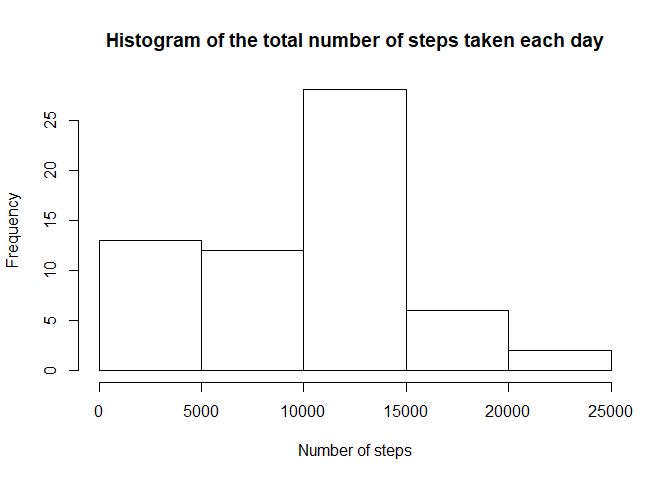
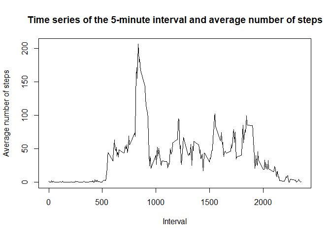
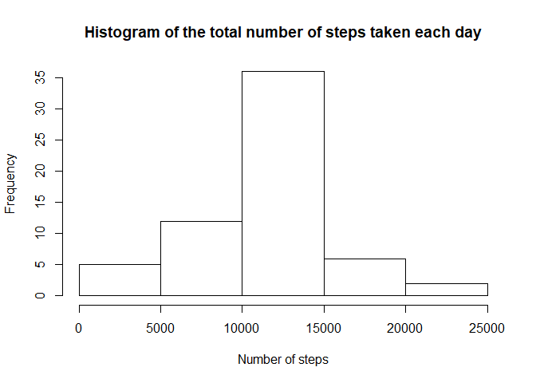

## Author: Pedro Manuel Moreno marcos

##### Line to ensure the locale is English regardless the language the reader is using.

```r
Sys.setlocale(category = "LC_ALL", locale = "english")
```

```
## [1] "LC_COLLATE=English_United States.1252;LC_CTYPE=English_United States.1252;LC_MONETARY=English_United States.1252;LC_NUMERIC=C;LC_TIME=English_United States.1252"
```

## Loading and preprocessing the data
#### 1. Load the data (i.e. read.csv())
The first step of this exercise is loading the data. To achieve this goal, we can use the command read.csv. We need to take into account that values are separated by ",".

```r
df = read.csv("activity.csv", sep = ",", dec = ".", stringsAsFactors = FALSE)
```

#### 2. Process/transform the data (if necessary) into a format suitable for your analysis
In general, there are not many problems with the current data format. We can convert dates to Date format (they are currently in character format) so we have them as Date for next sections. 

```r
df$date = as.Date(df$date)
```

## What is mean total number of steps taken per day?
#### 1. Calculate the total number of steps taken per day
The number of steps can be easily computed using summarize of the dplyr package. We just need to compute the sum of the steps column grouping by date. We will use na.rm to omit NA values. We will consider them later.

```r
library(dplyr)
```

```
## Warning: package 'dplyr' was built under R version 3.3.3
```

```
## 
## Attaching package: 'dplyr'
```

```
## The following objects are masked from 'package:stats':
## 
##     filter, lag
```

```
## The following objects are masked from 'package:base':
## 
##     intersect, setdiff, setequal, union
```

```r
nsteps_day = as.data.frame(summarize(group_by(df, date), nsteps_day=sum(steps, na.rm = T)))
```

```
## Warning: package 'bindrcpp' was built under R version 3.3.3
```

#### 2. If you do not understand the difference between a histogram and a barplot, research the difference between them. Make a histogram of the total number of steps taken each day
Now, we will make a histogram of the total number of steps per day.

```r
hist(nsteps_day$nsteps_day, xlab="Number of steps", main="Histogram of the total number of steps taken each day")
```

<!-- -->

#### 3. Calculate and report the mean and median of the total number of steps taken per day
We can see that the most frequent number of steps is between 10000-15000, but if we want to know about the mean and median, we can use mean and median commands:

```r
mean(nsteps_day$nsteps_day)
```

```
## [1] 9354.23
```

```r
median(nsteps_day$nsteps_day)
```

```
## [1] 10395
```
Result show that the mean is 9354.23 steps, while the median is 10395 steps.

## What is the average daily activity pattern?
#### 1. Make a time series plot (i.e. type = "l") of the 5-minute interval (x-axis) and the average number of steps taken, averaged across all days (y-axis)
In this section, we want to report about the average daily activity pattern. In order to do so, we will make a time series plot. Firstly, we need to know the average number of steps for each 5-minute interval. We can use summarize again grouping by interval to get the average. Afterwards, we can use plot to make the time series.

```r
avg_step_interval = as.data.frame(summarize(group_by(df, interval), avg=mean(steps, na.rm=T)))
plot(avg_step_interval$interval, avg_step_interval$avg, type="l", xlab="Interval", ylab="Average number of steps", main="Time series of the 5-minute interval and average number of steps")
```

<!-- -->

#### 2. Which 5-minute interval, on average across all the days in the dataset, contains the maximum number of steps?
If we want to know which 5-minute interval contain the maximum number of steps we can use the variable which contains the average number of steps per interval and take the interval whose average number of steps is maximum. We can use this code to achieve that.

```r
avg_step_interval[avg_step_interval$avg == max(avg_step_interval$avg),]$interval
```

```
## [1] 835
```
Result show that the interval between 08:35 and 08:40 am contains the maximum number of steps. We can confirm this interval by looking at the time series plot.

## Imputing missing values
Note that there are a number of days/intervals where there are missing values (coded as NA). The presence of missing days may introduce bias into some calculations or summaries of the data.

#### 1. Calculate and report the total number of missing values in the dataset (i.e. the total number of rows with NA)
At the beginning of the report, we mentioned that we would omit NA values. In this section, we would consider them and analyze their effect. Firstly, we will count the number of missing values. To do that, we will count the total number of rows and we will substract the number of complete cases (rows without NAs). We can confirm that the number of missing values is the same as the rows with missing values with is.na(df).

```r
na_rows = dim(df)[1] - sum(complete.cases(df))
na_values = sum(is.na(df))
na_rows
```

```
## [1] 2304
```

```r
na_values
```

```
## [1] 2304
```
There are 2304 missing values.

#### 2. Devise a strategy for filling in all of the missing values in the dataset. The strategy does not need to be sophisticated. For example, you could use the mean/median for that day, or the mean for that 5-minute interval, etc.
For the missing values, we will use the mean for that 5-minute interval. As we saw in the time series plot that the steps can vary depending on the time, it can be reasonable using the mean for each interval as an easy way to impute missing values.

#### 3. Create a new dataset that is equal to the original dataset but with the missing data filled in.
Now, we will carry out the abovementioned imputing strategy. To do that, we will merge the initial dataframe with the one that contains the average steps per interval. Next, we replace missing values with the average per 5-minute interval. Finally, we sort and re-order columns so that the final dataset has the same format and order than the original one.

```r
df2 = merge(df, avg_step_interval, by="interval")
df2$steps[is.na(df2$steps)] = df2$avg[is.na(df2$steps)]
df2 = subset(df2, select=-avg)
df2 = arrange(df2, date, interval)
df2 = df2[,c(2,3,1)]
```


#### 4. Make a histogram of the total number of steps taken each day and Calculate and report the mean and median total number of steps taken per day. Do these values differ from the estimates from the first part of the assignment? What is the impact of imputing missing data on the estimates of the total daily number of steps?
After creating the new dataset, we can carry out the same operations that we did before and we can make a histogram and compute the mean and median to analyze the impact of imputing missing data.

```r
nsteps_day2 = as.data.frame(summarize(group_by(df2, date), nsteps_day=sum(steps, na.rm = T)))
hist(nsteps_day2$nsteps_day, xlab="Number of steps", main="Histogram of the total number of steps taken each day")
```

<!-- -->

```r
mean(nsteps_day2$nsteps_day)
```

```
## [1] 10766.19
```

```r
median(nsteps_day2$nsteps_day)
```

```
## [1] 10766.19
```
We can see that the histogram is similar, although we can find more values in the centered column (as NA values are replaced with the mean). Mean and median also change from 9354.23 and 10395 to 10766.19 and 10766.19, respectively. Therefore, we can see that results can can be affected by this imputing. The difference between both means is 1411.96, which supposes an increase of about 15%. Therefore, NA values should not be neglected in the analysis.


## Are there differences in activity patterns between weekdays and weekends?
For this part the weekdays() function may be of some help here. Use the dataset with the filled-in missing values for this part.

#### 1. Create a new factor variable in the dataset with two levels - "weekday" and "weekend" indicating whether a given date is a weekday or weekend day.
In this last section, we want to delve into the differences between weekdays and weekends. Because of that, we will add new column to the dataset to indicate whether a date is a weekday or weekend. We use weekdays(), which retrieves the day of the week for each date. We then converted to "weekday" or "weekend".

```r
week_day = weekdays(df2$date)
week_day[week_day != "Saturday" & week_day != "Sunday"] = "weekday"
week_day[week_day == "Saturday" | week_day == "Sunday"] = "weekend"
df2[,4] = as.factor(week_day)
names(df2)[4] = "weekday_weekend"
```

#### 2. Make a panel plot containing a time series plot (i.e. type = "l") of the 5-minute interval (x-axis) and the average number of steps taken, averaged across all weekday days or weekend days (y-axis). See the README file in the GitHub repository to see an example of what this plot should look like using simulated data.
Finally, we can make time series plots, as we did previously, separing weekdays and weekend. Results show that, in general, there is more activity on the weekends.

```r
library(lattice)
avg_intday = as.data.frame(summarize(group_by(df2, interval, weekday_weekend), avg=mean(steps)))
xyplot(avg_intday$avg ~ avg_intday$interval | avg_intday$weekday_weekend, type="l", layout = c(1, 2), xlab="Interval", ylab="Number of steps")
```

<!-- -->
